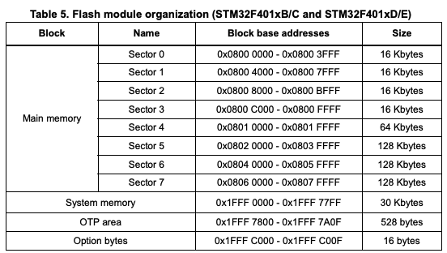

# A very simple example of using `embassy-boot-stm32`/`embassy-boot`  on the stm32f401 

Due to the sector sizes on this MCU the example bootloader strategies in the main repo didn't work as they expect a smaller more uniform set of flash sectors - i have no clue why ST thought it would be a good idea to choose such massive flash sizes.



The only viable solution using `embassy-boot` is to limit the application size to 128kb and use two of the other 128kb flash sectors as the dfu area:


```linker
MEMORY
{
  FLASH                             : ORIGIN = 0x08000000, LENGTH = 32K
  BOOTLOADER_STATE                  : ORIGIN = 0x08008000, LENGTH = 32K
  ACTIVE                            : ORIGIN = 0x08020000, LENGTH = 128K
  DFU                               : ORIGIN = 0x08040000, LENGTH = 256K
  RAM                         (rwx) : ORIGIN = 0x20000000, LENGTH = 96K
}
```

To run this example first flash the bootloader crate:

```shell
cd crates/bootloader && cargo run --release
```
This will flash the bootloader to the start of flash i had issues getting RTT logging working in both the bootloader and application so it is only available in the application right now.


```shell
cd crates/applications 
./build_b.sh
cargo run --release --bin a
```
The a binary waits for a button press to occur then copies the b binary over to the dfu area and restarts the application

